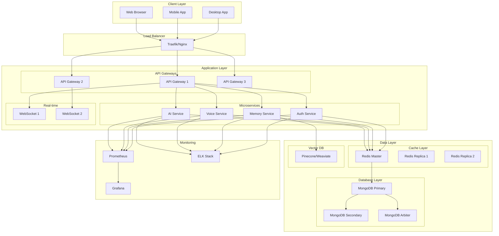

# Architecture# ARIS Neuro v3.0 - Архитектурный обзор

## Введение

ARIS Neuro v3.0 представляет собой распределенную микросервисную архитектуру для создания интеллектуального голосового ассистента. Система спроектирована для высокой доступности, масштабируемости и производительности.

## Технологический стек

### Backend
- **Node.js 18+**: Основной runtime
- **Express.js**: Web framework
- **Socket.IO**: WebSocket communication
- **MongoDB**: Document database
- **Redis**: Cache and sessions

### AI/ML
- **Python 3.10+**: ML runtime
- **PyTorch**: Deep learning framework
- **OpenAI Whisper**: Speech recognition
- **Coqui TTS**: Text-to-speech
- **Sentence Transformers**: Embeddings

### Infrastructure
- **Docker**: Containerization
- **Kubernetes**: Orchestration
- **Terraform**: Infrastructure as Code
- **GitLab CI/CD**: Continuous integration

### Monitoring
- **Prometheus**: Metrics collection
- **Grafana**: Visualization
- **ELK Stack**: Logging
- **Sentry**: Error tracking

## Диаграмма развертывания

---

File generated from project scaffold notes. Update as architecture evolves.